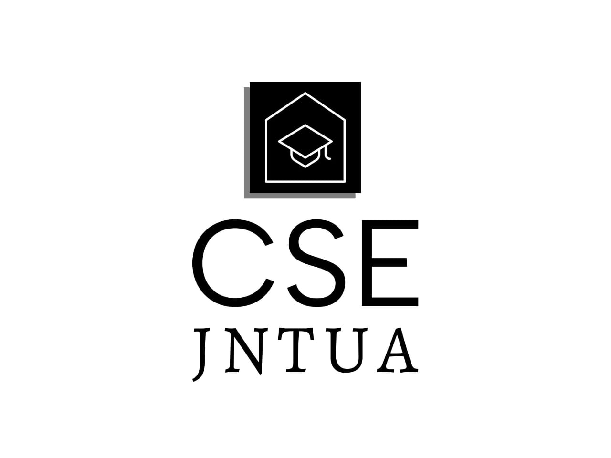

  

<h1>Welcome to CSE 2K21-2K25</h1>

🚀 CSE B.Tech Showcase Platform 🚀

Under the esteemed guidance of Professor P. Chenna Reddy, we're dedicated to showcasing the incredible talent and creativity of our Computer Science and Engineering (CSE) B.Tech students at JNTUA College of Engineering Anantapur in the field of Full Stack Development.

About
At CSE 2021-2025, our mission is to provide a space where students can exhibit their skills and share their projects in the field of Full Stack Development. We believe in fostering a culture of innovation and learning, empowering our students to excel in their technical endeavors.

Contribute 🌟
We welcome contributions from the community to enhance our platform. If you have any suggestions or if you believe there are areas where our website can be improved, we encourage you to submit a pull request on GitHub. Your contributions are invaluable in making our platform the best it can be.

🔧 Submit a Pull Request 🔧

Let's Connect 🌐
Follow us on social media to stay updated and join our community!

Thank you for being a part of our journey towards excellence in Computer Science and Engineering. Together, let's create and innovate!
